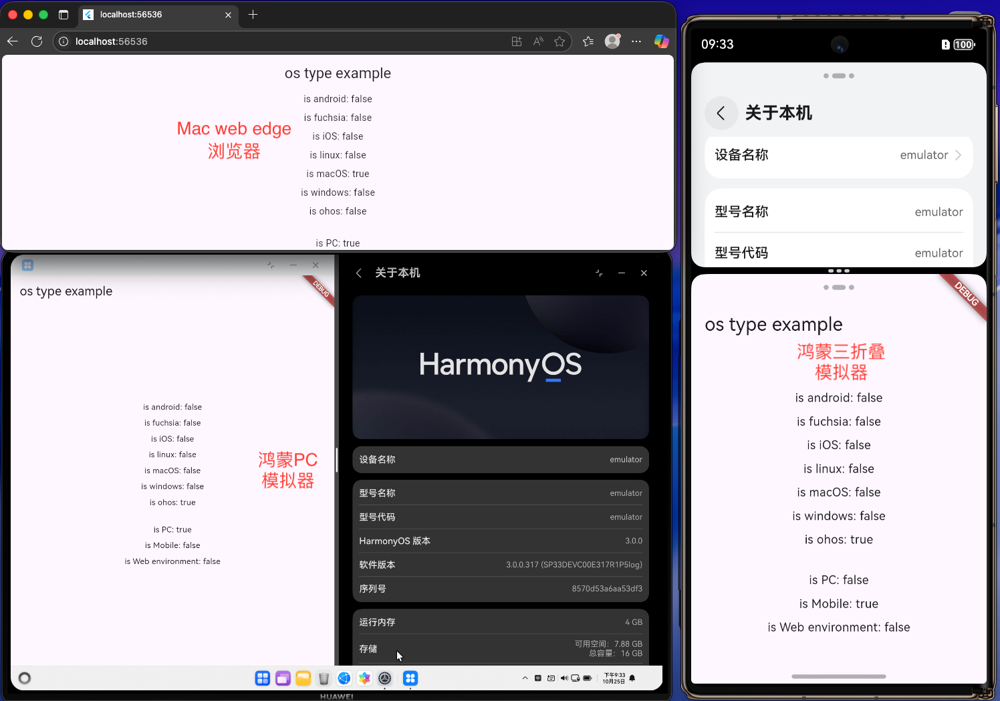

# os_type

🌐en:

Useful for OS and web environment detection, supports HarmonyOS

🌐 中文:

用于检测操作系统类型和 web 环境，支持鸿蒙

github: https://github.com/qinshah/os_type



## example:

```dart
import 'package:flutter/material.dart';
import 'package:os_type/os_type.dart';

Future<void> main() async {
  WidgetsFlutterBinding.ensureInitialized();
  // 如果需要在鸿蒙上判断是否为PC/Mobile，需要先await OS.initHarmonyDeviceType()
  if (OS.isHarmony) await OS.initHarmonyDeviceType();
  runApp(const MyApp());
}

class MyApp extends StatefulWidget {
  const MyApp({super.key});

  @override
  State<MyApp> createState() => _MyAppState();
}

class _MyAppState extends State<MyApp> {
  @override
  Widget build(BuildContext context) {
    return MaterialApp(
      home: Scaffold(
        appBar: AppBar(title: const Text('os type example')),
        body: Center(
          child: Column(
            mainAxisSize: MainAxisSize.min,
            children: [
              Text('is android: ${OS.isAndroid}'),
              SizedBox(height: 8),
              Text('is fuchsia: ${OS.isFuchsia}'),
              SizedBox(height: 8),
              Text('is iOS: ${OS.isIOS}'),
              SizedBox(height: 8),
              Text('is linux: ${OS.isLinux}'),
              SizedBox(height: 8),
              Text('is macOS: ${OS.isMacOS}'),
              SizedBox(height: 8),
              Text('is windows: ${OS.isWindows}'),
              SizedBox(height: 8),
              Text('is ohos: ${OS.isHarmony}'),
              SizedBox(height: 8),
              // 上面的列举有更简单的写法：
              // for (var os in TargetPlatform.values) ...[
              //   Text('is ${os.name}: ${OS.value == os}'),
              //   SizedBox(height: 8),
              // ],

              // pc和mobile是相反的，而web环境则等于kIsWeb，与操作系统无关
              SizedBox(height: 20),
              Text('is PC: ${OS.isPCOS}'),
              SizedBox(height: 8),
              Text('is Mobile: ${OS.isMobileOS}'), // isMobileOS == !isPCOS
              SizedBox(height: 8),
              Text('is Web environment: ${OS.isWebEnv}'), // isWebEnv == kIsWeb
              SizedBox(height: 8),
            ],
          ),
        ),
      ),
    );
  }
}
```

## License:

[License](LICENSE)
